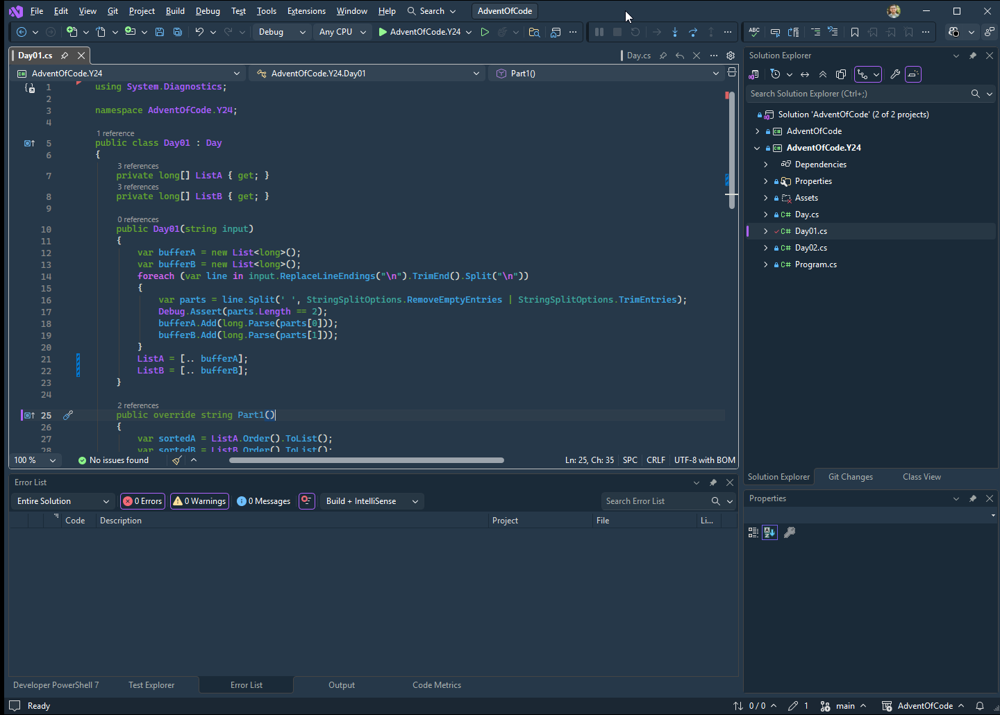

# Helion - A Dark Theme for Visual Studio

Helion is a WCAG-compliant mid-contrast color palette inspired by [Solarized](https://ethanschoonover.com/solarized/), as well as colors that faded away — pigments whose manufacture have been lost or replaced, either due to hard-to-find materials or, more often, toxicity.

----------------------------------------

This extension runs best on Visual Studio 2026.

This is a reimplementation of my existing [VS Code](https://github.com/brandongandy/helion.vscode) theme of the same name.

## Screenshots

## License

See `LICENSE.txt`

## Contributions

Due to Visual Studio's many fun quirks and choices, there may be areas that are incompletely themed. If you spot something or want to contribute, please [open an issue](https://github.com/brandongandy/helion.visual-studio/issues) or PR.